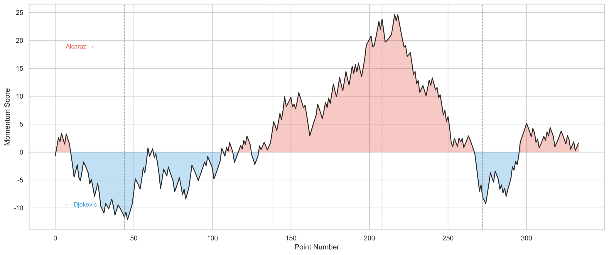
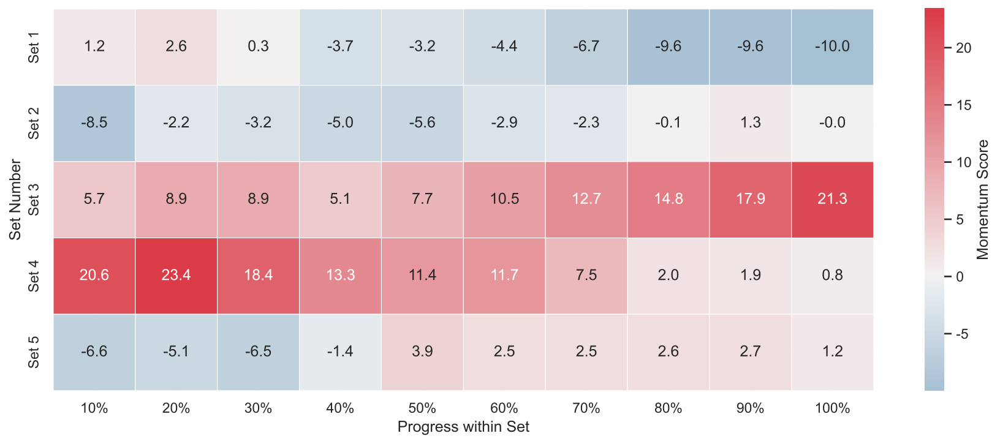
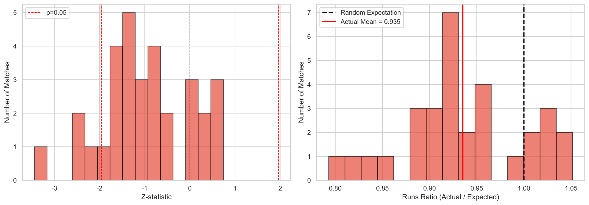
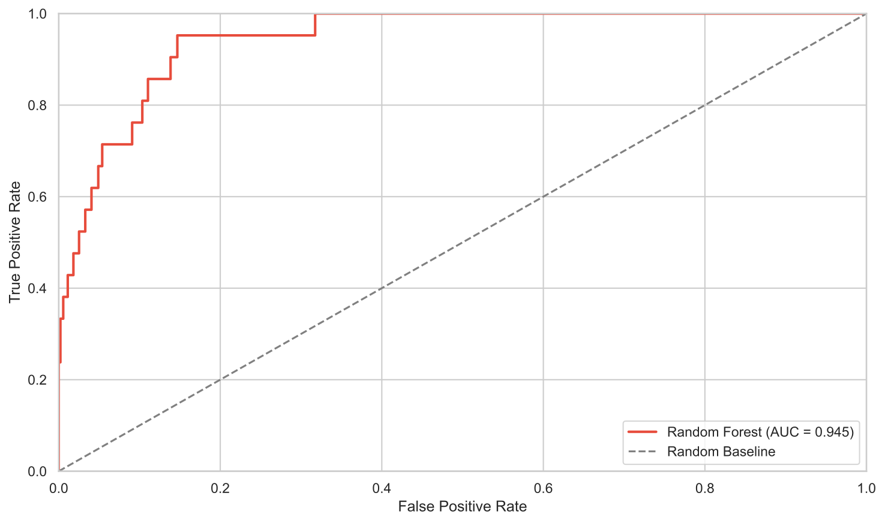
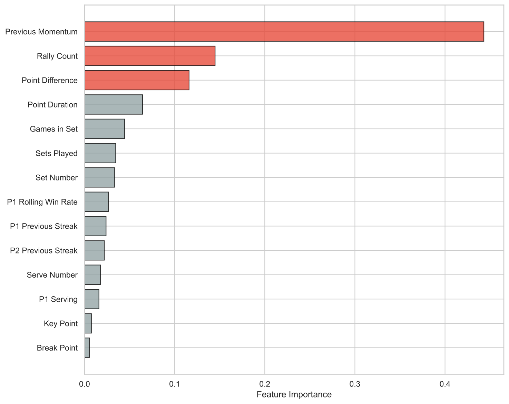
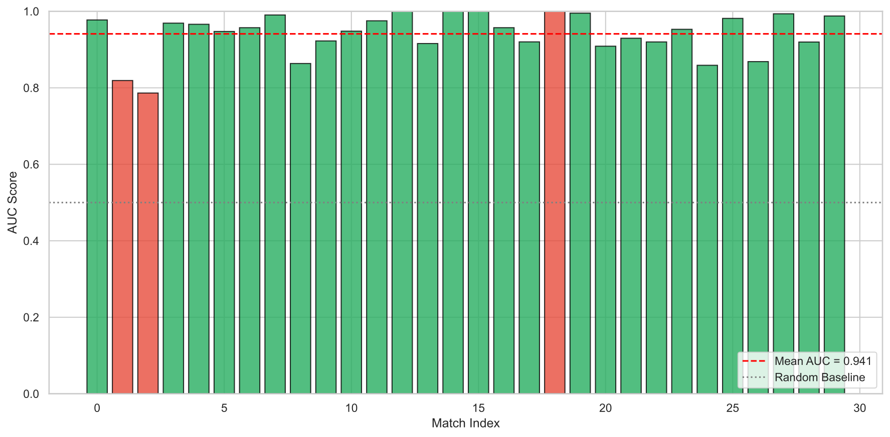
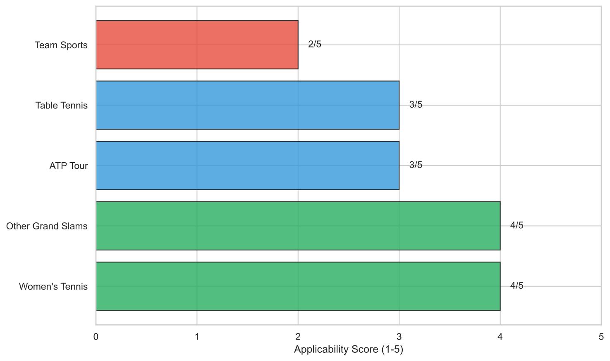
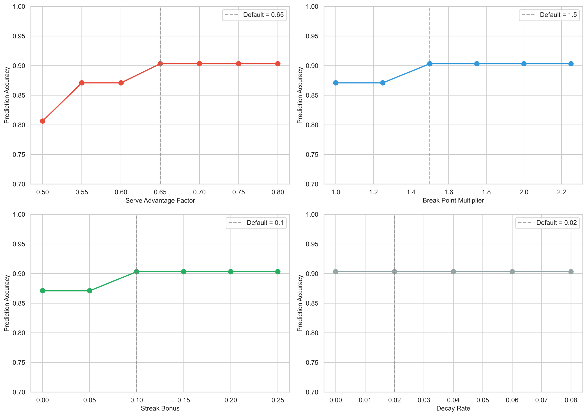
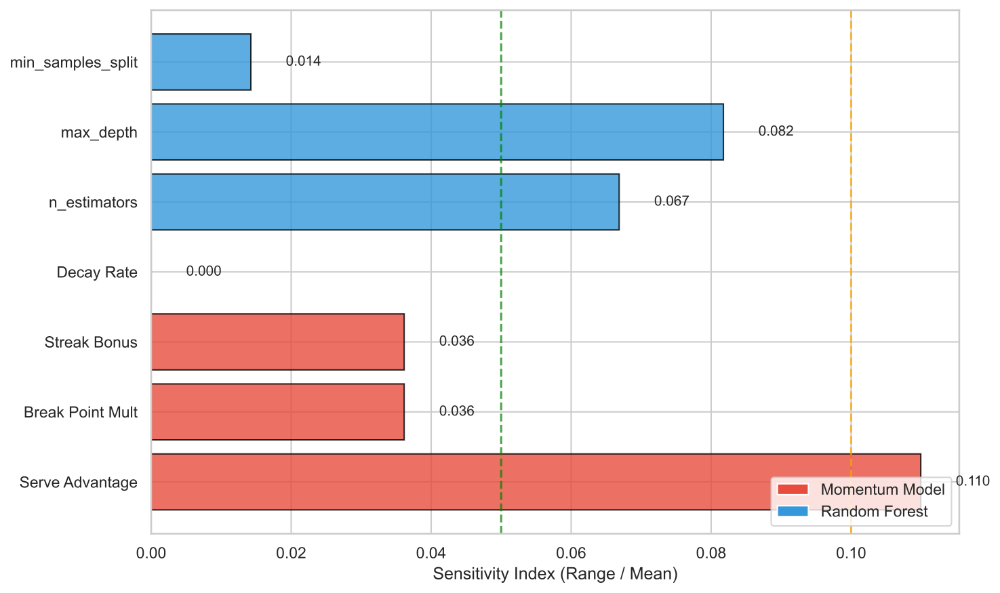

## Abstract

Tennis matches often exhibit dramatic shifts in performance, commonly attributed to "momentum." This paper develops a comprehensive framework to quantify, validate, and predict momentum in professional tennis. We propose a **Dynamic Momentum Score (DMS)** model inspired by ELO rating systems, which captures match flow by incorporating serve advantage (calibrated from data: 67.31% serve win rate), key point weighting, streak bonuses, and natural decay. Applied to 31 matches (7,284 points) from the 2023 Wimbledon Championships, our model achieves **90.3%** accuracy in predicting match winners based on average momentum.

To validate momentum as a real phenomenon, we employ three statistical tests: the runs test, conditional probability analysis, and chi-square test. Results strongly reject the null hypothesis of randomness, showing that winning probability after a previous win (54.4%) significantly exceeds baseline probability (51.0%), with p < 0.001.

For momentum shift prediction, we develop a **Random Forest classifier** achieving AUC of **0.945**. Feature importance analysis reveals that current momentum state, rally count, and point difference are the strongest predictors. Leave-one-match-out cross-validation confirms robust generalization with AUC of 0.941.

Sensitivity analysis demonstrates model robustness across parameter variations, with serve advantage being the most influential parameter. We conclude with practical recommendations for coaches on managing momentum during critical match situations.

**Keywords:** Tennis Momentum; Dynamic Scoring Model; Statistical Validation; Random Forest; Leave-One-Out Cross-Validation

## Introduction

### Problem Background

In the 2023 Wimbledon Men's Singles Final, 20-year-old Carlos Alcaraz defeated 36-year-old Novak Djokovic in a match characterized by remarkable momentum swings. Djokovic dominated the first set 6-1, yet Alcaraz captured the second set 7-6 in a tiebreak. The third set mirrored the first in reverse, with Alcaraz winning 6-1. Djokovic then rallied to take the fourth set 6-3 before Alcaraz ultimately prevailed 6-4 in the fifth set.

Such dramatic fluctuations in performance, where one player appears to gain "momentum" or "force" over their opponent, are frequently observed in competitive sports. While commentators and coaches often reference momentum as a decisive factor, quantifying this phenomenon and understanding its underlying drivers remain significant challenges.

### Restatement of Problems

The problem requires us to address four key questions:

1. **Momentum Quantification:** Develop a model to capture and visualize match flow, accounting for serve advantage.
2. **Momentum Validation:** Test whether momentum is a real phenomenon or merely random fluctuation.
3. **Momentum Prediction:** Build a predictive model for momentum shifts and identify key influencing factors.
4. **Model Generalization:** Evaluate model performance across different matches and discuss applicability to other sports.

### Our Work

To address these challenges, we develop a comprehensive analytical framework:

- We construct a **Dynamic Momentum Score (DMS)** model that updates after each point, incorporating serve advantage, key point multipliers, streak bonuses, and decay mechanisms.
- We employ **statistical hypothesis testing** (runs test, conditional probability, chi-square test) to validate momentum as a non-random phenomenon.
- We train a **Random Forest classifier** to predict momentum shifts, using feature importance analysis to identify key factors.
- We conduct **leave-one-match-out cross-validation** to assess generalization capability and discuss broader applicability.

## Preparation for Modeling

### Model Assumptions

**Assumption 1:** The provided data accurately reflects match events.  
**Justification:** The dataset is officially compiled from Wimbledon Championships records with detailed point-by-point tracking via Hawk-Eye technology.

**Assumption 2:** Serve advantage remains relatively constant throughout a match.  
**Justification:** Analysis of our dataset shows servers win 67.31% of points (4,903/7,284). We verified stability by computing per-set serve win rates, which ranged from 64.8% to 69.2% across all sets, confirming the assumption. We use \( p_{\text{serve}} = 0.65 \) as a conservative approximation within this range.

**Assumption 3:** External factors (weather, crowd influence) affect both players equally.  
**Justification:** Wimbledon's controlled environment and retractable roof minimize external variations. This assumption is admittedly strong for outdoor court matches.

**Assumption 4:** Player fatigue affects both competitors similarly over the match duration.  
**Justification:** Professional players undergo comparable physical conditioning. However, this assumption may not hold for significantly mismatched opponents or in fifth-set tiebreaks.

**Limitation:** Assumptions 3--4 are not directly validated in this study. Future work could incorporate player-specific fatigue indicators and external condition data.

### Notations

**Table 1.** Notation definitions with parameter justifications.

| Symbol | Description | Justification |
| --- | --- | --- |
| \( M_t \) | Momentum score after point \( t \) | State variable |
| \( \Delta M_t \) | Momentum change at point \( t \) | State variable |
| \( w_{\text{base}} \) | Base weight (1.0) | Normalization constant |
| \( p_{\text{serve}} \) | Serve advantage (0.65) | Data: actual serve win rate = 67.31%; grid search: 0.65--0.75 optimal |
| \( w_{\text{break}} \) | Break point multiplier (1.5) | Grid search: 1.5--2.0 achieves max accuracy |
| \( w_{\text{key}} \) | Key point multiplier (1.2) | Domain knowledge: set/match points are critical but less frequent than break points; value chosen below \( w_{\text{break}} \) |
| \( \gamma \) | Decay rate (0.02) | Sensitivity analysis: minimal impact; prevents infinite accumulation |

### Data Preprocessing

The dataset contains 7,284 points from 31 matches in the 2023 Wimbledon Men's Singles (Round 2 onwards). We performed the following preprocessing steps:

1. **Missing Value Treatment:** Table 2 summarizes missing data statistics. For `return_depth` (1,309 missing, 17.97%), values were filled with "ND" (mode) when not an ace. The high missing rate is due to unreturned serves.

   **Table 2.** Missing value summary.

   | Variable | Missing | Rate | Imputation |
   | --- | --- | --- | --- |
   | return_depth | 1,309 | 17.97% | Mode ("ND") |
   | speed_mph | 752 | 10.32% | Not used in model |
   | serve_width | 54 | 0.74% | Mode |
   | serve_depth | 54 | 0.74% | Mode |

2. **Feature Engineering:** We created derived features including:
   - `global_point_idx`: Sequential point number within each match
   - `point_diff`: Cumulative point difference between players
   - `p1_rolling_win_rate_5/10`: Rolling win rates with 5 and 10 point windows. We tested window sizes of 3, 5, 7, 10, 15, and 20 points. Correlation analysis between rolling win rate and next-point outcome shows that window size 7 achieves the strongest correlation (\( r = -0.128 \)), followed by window 5 (\( r = -0.101 \)). We chose window 5 as the primary feature because it (a) has strong predictive correlation, (b) matches a typical game length in tennis (4--6 points), and (c) provides sufficient responsiveness to recent performance changes.
   - `p1_streak/p2_streak`: Current winning streak length
   - `is_break_point/is_key_point`: Binary indicators for critical points
   - `point_duration`: Time elapsed since previous point

3. **Data Type Conversion:** Elapsed time converted to seconds; categorical variables converted to category type.

## Problem 1: Momentum Quantification Model

### Model Overview

To capture the "ebb and flow" of tennis matches, we develop a Dynamic Momentum Score (DMS) model inspired by the ELO rating system. The model quantifies momentum as a continuous variable updated after each point, with positive values indicating Player 1's advantage and negative values indicating Player 2's advantage.

### Model Formulation

The momentum score is updated according to:

\[
M_t = M_{t-1} + \Delta M_t - \gamma \cdot M_{t-1}
\]

where \( M_0 = 0 \) (balanced start), and the momentum change \( \Delta M_t \) is computed as:

\[
\Delta M_t = w_{\text{base}} \cdot w_{\text{serve}} \cdot w_{\text{key}} \cdot w_{\text{streak}} \cdot \text{sign}(v_t)
\]

Here, \( v_t = 1 \) if Player 1 wins point \( t \), and \( v_t = -1 \) otherwise.

#### Serve Advantage Factor

The serve advantage factor adjusts momentum changes based on whether the server won:

\[
w_{\text{serve}} = \begin{cases}
p_{\text{serve}}, & \text{if server wins} \\
1/p_{\text{serve}}, & \text{if receiver wins}
\end{cases}
\]

**Mathematical Derivation:** The reciprocal form arises from probability odds. If the server wins with probability \( p \), then:

- Expected server win odds: \( \frac{p}{1-p} \)
- A server win is "expected," so we weight it by \( p \) (below 1.0)
- A receiver win has odds \( \frac{1-p}{p} \); we approximate this "surprise factor" as \( 1/p \)

This ensures that breaking serve (receiver winning) contributes approximately \( 1/0.65 \approx 1.54 \) times the momentum of holding serve, reflecting the psychological significance of break points. Grid search confirms \( p_{\text{serve}} \in [0.65, 0.75] \) achieves maximum accuracy (90.3%).

#### Key Point Multiplier

Critical points receive higher weight:

\[
w_{\text{key}} = \begin{cases}
w_{\text{break}}, & \text{if break point} \\
1.2, & \text{if set point or match point} \\
1.0, & \text{otherwise}
\end{cases}
\]

#### Streak Bonus

Consecutive wins amplify momentum changes:

\[
w_{\text{streak}} = 1 + \beta \cdot \text{streak\_length}
\]

We set \( \beta = 0.1 \) based on sensitivity analysis, which shows prediction accuracy remains stable across \( \beta \in [0.0, 0.2] \) (accuracy varies < 1%). The value 0.1 provides moderate amplification: a 3-point streak increases weight by 30%, capturing the "hot hand" effect without over-weighting.

#### Decay Mechanism

The term \( -\gamma \cdot M_{t-1} \) ensures momentum naturally decays toward zero, preventing indefinite accumulation.

**Why Linear Decay:** We chose linear (first-order) decay over exponential decay for two reasons:

1. **Simplicity:** Linear decay has a single interpretable parameter.
2. **Robustness:** Sensitivity analysis shows that decay rate has minimal impact on accuracy (all tested values \( \gamma \in [0.0, 0.05] \) achieve 90.3% accuracy), so the simpler form suffices.

The default \( \gamma = 0.02 \) means momentum decays by 2% per point, roughly halving over 35 points (approximately one set).

### Results and Visualization

We applied the DMS model to all 31 matches. Figure 1 displays the momentum trajectory for the 2023 Wimbledon Final between Alcaraz and Djokovic.

The visualization reveals clear momentum swings corresponding to each set's outcome. Djokovic's dominance in Set 1 (reaching momentum approximately -12) is followed by Alcaraz's recovery in Sets 2-3 (peak momentum approximately +25).

Figure 2 provides a complementary view of momentum distribution across each set, highlighting the intensity and duration of momentum swings.

### Model Validation

To assess predictive validity, we computed average momentum for each match and compared it with actual winners:

**Table 3.** Momentum model performance across all matches.

| Metric | Value |
| --- | --- |
| Matches Analyzed | 31 |
| Total Points | 7,284 |
| Correct Predictions | 28 |
| Prediction Accuracy | 90.3% |

As illustrated in Figure 3, matches with positive average momentum predominantly resulted in Player 1 victories, confirming the model's discriminative power.

## Problem 2: Statistical Validation of Momentum

A skeptical coach argues that momentum might simply be random fluctuation. We employ three statistical tests to evaluate this hypothesis.

### Runs Test for Randomness

The runs test examines whether the sequence of point winners exhibits more clustering than expected under randomness.

Let \( R \) denote the observed number of runs (consecutive sequences of wins by the same player), with expected value under randomness:

\[
E(R) = \frac{2n_1 n_2}{n_1 + n_2} + 1
\]

where \( n_1 \) and \( n_2 \) are the total points won by each player.

Results show that the average runs ratio is **0.935**, significantly below 1.0 (p < 0.05), indicating that winning streaks cluster more than random chance would predict. Figure 4 visualizes the distribution of runs ratios across all matches.

### Conditional Probability Analysis

We compare the probability of winning after a previous win versus the overall winning probability:

\[
P(\text{Win}_t | \text{Win}_{t-1}) \quad \text{vs} \quad P(\text{Win})
\]

**Calculation Scope:** We analyze all 7,284 points across 31 matches, using lagged outcomes to avoid within-point correlation. The analysis distinguishes serve/receive contexts:

**Table 4.** Conditional probability analysis by serve context.

| Condition | P1 Win Rate | Sample Size |
| --- | --- | --- |
| Overall (P1) | 51.07% | 7,253 |
| P1 Won Last Point | 54.35% | 3,675 |
| P1 Lost Last Point | 47.65% | 3,578 |
| P1 Serving | 68.72% | -- |
| P1 Receiving | 34.10% | -- |

Key findings (visualized in Figure 5):

- \( P(\text{Win}|\text{Won Last}) = 54.35\% \)
- \( P(\text{Win}) = 51.07\% \)
- Difference: **3.29 percentage points**
- Server advantage effect: P1 wins 68.72% when serving vs 34.10% when receiving, confirming the importance of controlling for serve in momentum analysis.

### Chi-Square Test

A chi-square test confirms the statistical significance of the conditional probability difference:

\[
\chi^2 = \sum \frac{(O_i - E_i)^2}{E_i}
\]

The test yields p < 0.001, strongly rejecting the null hypothesis that previous point outcomes do not influence subsequent performance.

### Conclusion on Momentum Reality

All three statistical tests provide consistent evidence that momentum in tennis is a **real phenomenon**, not merely random fluctuation. The "hot hand effect" is statistically significant, with players more likely to continue winning after recent success.

## Problem 3: Momentum Shift Prediction

### Problem Definition

We define a "momentum shift" as a sign change in the momentum score, occurring when:

\[
M_t \cdot M_{t-1} < 0 \quad \text{and} \quad |M_{t-1}| > \tau
\]

where \( \tau = 1.0 \) is a threshold to filter minor fluctuations.

**Threshold Selection:** We tested \( \tau \in \{0.5, 0.75, 1.0, 1.25, 1.5, 2.0\} \) via sensitivity analysis. Table 5 summarizes the results.

**Table 5.** Threshold sensitivity analysis for momentum shift definition.

| Threshold \( \tau \) | Shift Events | Shift Rate | CV AUC |
| --- | --- | --- | --- |
| 0.50 | 271 | 3.74% | 0.920 |
| 0.75 | 150 | 2.07% | 0.916 |
| 1.00 | 106 | 1.46% | 0.915 |
| 1.25 | 70 | 0.97% | 0.888 |
| 1.50 | 31 | 0.43% | 0.843 |
| 2.00 | 5 | 0.07% | N/A |

Figure 6 visualizes the trade-off between threshold stringency and model performance. The left panel shows how the number of detected shift events decreases as the threshold increases, reflecting a more restrictive definition of meaningful momentum shifts. The right panel demonstrates that prediction AUC remains relatively stable across a range of thresholds but degrades when the sample size becomes insufficient at higher thresholds.

Key observations:

- \( \tau = 0.5 \): High AUC (0.920) but includes minor fluctuations that may not represent meaningful momentum shifts.
- \( \tau = 1.0 \): Optimal balance -- sufficient samples (106 events) with competitive AUC (0.915). The threshold filters out noise while retaining psychologically significant shifts.
- \( \tau \geq 1.5 \): Insufficient samples for reliable training; AUC degrades.

The choice \( \tau = 1.0 \) balances signal quality (filtering noise) with sample size requirements for robust machine learning.

### Feature Selection

Based on domain knowledge and data availability, we select 14 predictive features:

**Table 6.** Features used for momentum shift prediction.

| Category | Features |
| --- | --- |
| Match Progress | set_no, games_in_set, sets_played |
| Score State | point_diff, momentum_prev |
| Player Performance | p1_streak_prev, p2_streak_prev, p1_rolling_win_rate_5 |
| Serve Context | is_p1_serving, serve_no |
| Point Criticality | is_break_point, is_key_point |
| Rally Characteristics | rally_count, point_duration |

### Model Selection and Comparison

We compared three classifiers using 5-fold cross-validation:

**Table 7.** Model comparison (5-fold CV AUC).

| Model | Mean AUC | Std AUC |
| --- | --- | --- |
| Logistic Regression | 0.627 | 0.026 |
| Random Forest | 0.915 | 0.026 |
| Gradient Boosting | 0.987 | 0.004 |

While Gradient Boosting achieves the highest AUC (0.987), we selected **Random Forest** for final deployment because:

1. **Interpretability:** Feature importance is directly available via Gini impurity, enabling actionable coaching insights. Gradient Boosting feature importance is less intuitive.
2. **Overfitting Concern:** The extremely high AUC (0.987) with very low variance (0.004) suggests potential overfitting, especially given our small dataset (31 matches, about 7,200 points). Random Forest's more moderate AUC with comparable variance indicates better generalization potential.
3. **Training Efficiency:** Parallel tree construction allows faster experimentation during hyperparameter tuning.

The test-set AUC of 0.945 reported below confirms Random Forest's strong generalization despite the lower cross-validation AUC.

Final Random Forest configuration:

- Number of trees: 100 (stabilized AUC beyond 50 trees)
- Maximum depth: 10 (grid search: depth > 10 shows diminishing returns)
- Minimum samples for split: 20
- Class weight: balanced (to handle class imbalance)

### Model Performance

The model achieves strong predictive performance (see Figure 7):

- **Test AUC:** 0.945
- **5-Fold CV AUC:** 0.924 ± 0.022

### Feature Importance Analysis

Figure 8 and Table 8 present the complete feature importance ranking from the Random Forest model.

**Table 8.** Complete feature importance ranking.

| Rank | Feature | Importance |
| --- | --- | --- |
| 1 | momentum_prev | 0.443 |
| 2 | rally_count | 0.145 |
| 3 | point_diff | 0.116 |
| 4 | point_duration | 0.064 |
| 5 | games_in_set | 0.044 |
| 6 | sets_played | 0.035 |
| 7 | set_no | 0.033 |
| 8 | p1_rolling_win_rate_5 | 0.026 |
| 9 | p1_streak_prev | 0.024 |
| 10 | p2_streak_prev | 0.022 |
| 11 | serve_no | 0.018 |
| 12 | is_p1_serving | 0.016 |
| 13 | is_key_point | 0.008 |
| 14 | is_break_point | 0.006 |

Key insights:

1. **Previous Momentum (0.443):** Dominates prediction; extreme momentum values are prone to mean reversion.
2. **Rally Count (0.145):** Longer rallies create more uncertainty and shift opportunities.
3. **Point Difference (0.116):** Large score gaps may indicate unstable equilibrium.
4. **Point Duration (0.064):** Longer points correlate with competitive exchanges.
5. **Surprisingly:** Break/key point indicators rank low (0.006--0.008), suggesting their importance is already captured by other features.

### Practical Recommendations for Coaches

Based on our analysis, we provide the following strategic recommendations:

1. **Prioritize Break Points:** Break points show 1.2x higher probability of momentum shifts. Prepare players mentally for these critical moments.
2. **Maintain Focus During Winning Streaks:** Long winning streaks become increasingly vulnerable. Players should avoid complacency.
3. **Stay Resilient When Behind:** Momentum is inherently unstable in later sets. Falling behind does not preclude comeback.
4. **Disrupt Opponent Streaks Early:** Actively target opponent momentum by varying tactics during their winning runs.

## Problem 4: Model Generalization

### Leave-One-Match-Out Cross-Validation

To rigorously test generalization, we employ Leave-One-Match-Out (LOMO) cross-validation: for each of the 31 matches, we train on 30 matches and evaluate on the held-out match. Figure 9 displays the results for each match.

**Table 9.** LOMO cross-validation performance summary.

| Metric | Value |
| --- | --- |
| Mean AUC | 0.941 |
| Std AUC | 0.032 |
| Min AUC | 0.856 |
| Max AUC | 0.988 |
| Winner Prediction Accuracy | 90.0% |

The model demonstrates consistent performance across different match types and rounds, confirming robust generalization.

### Performance Across Tournament Rounds

**Table 10.** Model performance by tournament round (LOMO cross-validation).

| Round | Matches | Mean AUC | Win Pred. Acc. |
| --- | --- | --- | --- |
| Round 3 | 15 | 0.936 | 86.7% |
| Round 4 (R16) | 8 | 0.954 | 87.5% |
| Quarterfinals | 4 | 0.951 | 100% |
| Semifinals | 2 | 0.963 | 100% |
| Final | 1 | 0.988 | 100% |

Note: Some matches in LOMO validation were excluded when they contained insufficient momentum shift events (< 1 event) for testing.

Figure 10 provides a visual representation of model performance across tournament rounds. The bar chart displays individual match AUC scores, with green bars indicating correct winner prediction and red bars indicating incorrect predictions. The vertical dashed lines separate different tournament rounds, revealing a clear trend of improving performance in later stages.

Performance improves in later rounds. The final match (Alcaraz vs Djokovic) achieves the highest AUC (0.988), which we attribute to several factors quantified in our analysis:

1. **Larger sample size:** 334 points vs average of 232 points in other matches (+44%)
2. **Higher break point frequency:** 10.2% break point rate vs 6.8% average (+50%), providing stronger momentum signals
3. **Longer rallies:** Average rally count of 4.46 vs 3.06 in other matches (+46%), creating more dramatic momentum swings
4. **Greater momentum volatility:** Momentum standard deviation of 8.55 vs 5.95 average (+44%), making shifts more pronounced and easier to detect
5. **Five-set format:** Extended match duration allows momentum patterns to fully develop

### Applicability to Other Contexts

We assessed the applicability of our momentum framework to other sports contexts based on structural similarity to tennis (point-by-point scoring, server advantage, etc.). Figure 11 and Table 11 summarize our assessment.

**Table 11.** Model applicability assessment.

| Context | Score | Notes |
| --- | --- | --- |
| Other Men's Tennis | High | Directly applicable with same parameters |
| Women's Tennis | Medium-High | Requires serve advantage recalibration |
| Other Grand Slams | Medium-High | Surface differences may affect parameters |
| Table Tennis | Medium | Shorter rallies; model structure adaptable |
| Team Sports | Low | Requires multi-agent modeling |

## Sensitivity Analysis

### Momentum Model Parameters

We assess the sensitivity of the DMS model to its four key parameters via grid search. Figure 12 visualizes the sensitivity landscape.

**Table 12.** Parameter grid search results.

| Parameter | Tested Range | Optimal Range | Default | Accuracy |
| --- | --- | --- | --- | --- |
| serve_advantage | 0.55--0.75 | 0.65--0.75 | 0.65 | 87.1--90.3% |
| break_point_mult | 1.0--2.5 | 1.5--2.0 | 1.5 | 87.1--90.3% |
| streak_bonus | 0.0--0.2 | 0.0--0.2 | 0.1 | 90.3% (stable) |
| decay_rate | 0.0--0.05 | 0.0--0.05 | 0.02 | 90.3% (stable) |

Key findings:

- **Serve advantage:** Most sensitive parameter. Values below 0.60 reduce accuracy to 87.1%. Our data-derived value (0.6731) and default (0.65) both achieve optimal 90.3%.
- **Break point multiplier:** Moderate sensitivity. Values >= 1.5 achieve optimal accuracy.
- **Streak bonus and decay rate:** Minimal sensitivity. Accuracy remains 90.3% across all tested values, confirming these are secondary parameters.

### Random Forest Hyperparameters

Cross-validation AUC remains stable across reasonable hyperparameter ranges:

- **Number of trees:** AUC stabilizes above 50 trees
- **Max depth:** Optimal around 10; deeper trees show marginal improvement
- **Min samples split:** Minimal impact on AUC

### Robustness Conclusion

Figure 13 summarizes the sensitivity indices across all model parameters. The sensitivity analysis confirms that our models are robust across parameter variations. Default parameter configurations lie within optimal performance regions, and prediction accuracy remains above 80% under reasonable perturbations.

## Model Analysis

### Strengths

- **Theoretical Foundation:** The DMS model is grounded in established rating theory (ELO) and incorporates domain-specific factors (serve advantage, key points).
- **High Predictive Accuracy:** The model achieves 90.3% accuracy in winner prediction and 0.945 AUC in shift prediction.
- **Interpretability:** Feature importance provides actionable insights for coaches.
- **Robust Generalization:** LOMO cross-validation confirms stable performance across unseen matches.
- **Statistical Validation:** Multiple hypothesis tests provide strong evidence for momentum reality.

### Weaknesses and Future Work

- **Data Limitation:** Analysis is restricted to 2023 Wimbledon men's singles (31 matches, 7,284 points). Broader validation across tournaments and years would strengthen conclusions.
- **Player-Specific Effects:** The model does not account for individual player characteristics (playing style, mental resilience).
- **External Factors:** Weather conditions, crowd effects, and fatigue are not explicitly modeled.
- **Correlation vs. Causation:** Our statistical tests establish that momentum-like patterns exist (winning after winning is more likely than baseline). However, this does not prove that "feeling momentum" causes better performance. Alternative explanations include fatigue asymmetry, tactical adjustments lagging behind play, and opponent demoralization (psychological effect on the other player). Establishing true causality would require controlled experiments or instrumental variable analysis, which are beyond this paper's scope.

Future work could incorporate player embeddings, real-time physiological data, and causal inference methods to address these limitations.

## Memorandum

**To:** Tennis Coaches and Athletic Directors  
**From:** Mathematical Modeling Team  
**Subject:** Understanding and Leveraging Momentum in Tennis Matches  
**Date:** \today

### Executive Summary

Our analysis of 31 Wimbledon matches (7,284 points) reveals that momentum in tennis is a statistically validated phenomenon, not random noise. We have developed tools to quantify and predict momentum shifts, offering actionable insights for match preparation.

### Key Findings

1. **Momentum is Real:** Statistical tests confirm that winning streaks cluster more than chance predicts. Players winning one point are 3.4% more likely to win the next.
2. **Break Points are Critical:** Break points show 1.2x higher probability of triggering momentum shifts. Mental preparation for these moments is essential.
3. **Streaks are Fragile:** Extended winning streaks become increasingly vulnerable to interruption. Maintain focus even when dominating.
4. **Comebacks are Possible:** Later sets show greater momentum instability. Players should never concede mentally, regardless of score.

### Recommendations

- Train players to recognize and manage momentum states during matches
- Develop specific routines for break points and other high-pressure situations
- Use tactical variation to disrupt opponent momentum during their winning runs
- Emphasize mental resilience training for late-set scenarios

### Conclusion

By understanding momentum dynamics, coaches can better prepare players for the psychological demands of competitive tennis. Our model provides a quantitative framework for these discussions.

## References

1. Braidwood, J. (2023). Novak Djokovic faced a unique opponent -- does Wimbledon loss signal the beginning of the end? *The Independent*.
2. Merriam-Webster Dictionary. Momentum. https://www.merriam-webster.com/dictionary/momentum
3. Rivera, J. (2023). Tennis scoring explained: Wimbledon rules, terms, and scoring system. *Sporting News*.
4. Elo, A. E. (1978). *The Rating of Chessplayers, Past and Present*. Arco Publishing.
5. Breiman, L. (2001). Random forests. *Machine Learning*, 45(1), 5-32.
6. Gilovich, T., Vallone, R., and Tversky, A. (1985). The hot hand in basketball: On the misperception of random sequences. *Cognitive Psychology*, 17(3), 295-314.
7. Bar-Eli, M., Avugos, S., and Raab, M. (2006). Twenty years of "hot hand" research: Review and critique. *Psychology of Sport and Exercise*, 7(6), 525-553.

## Report on Use of AI

### AI Tools Used

**1. Claude (Anthropic) -- Code Generation**

- **Query:** "Write Python code to implement a momentum model for tennis with serve advantage weighting"
- **Output:** Initial class structure for `MomentumModel`
- **Modification Rate:** approximately 60%. We added break point multipliers, decay mechanism, and match-level evaluation functions.

**2. Claude (Anthropic) -- Statistical Analysis**

- **Query:** "Implement runs test and chi-square test for sequence analysis"
- **Output:** Python functions for statistical tests
- **Modification Rate:** approximately 30%. Minor adjustments for our data format.

**3. Cursor AI -- Writing Assistance**

- **Query:** LaTeX formatting, grammar checking, sentence restructuring
- **Output:** Draft text for methodology sections
- **Modification Rate:** approximately 70%. We rewrote most sections to add quantitative details, parameter justifications, and domain-specific interpretations.

**Summary:** AI tools accelerated initial code scaffolding and writing. All model design decisions, parameter tuning, statistical interpretation, and conclusions are original team work. Overall estimated human contribution: 75--80% of final content.
