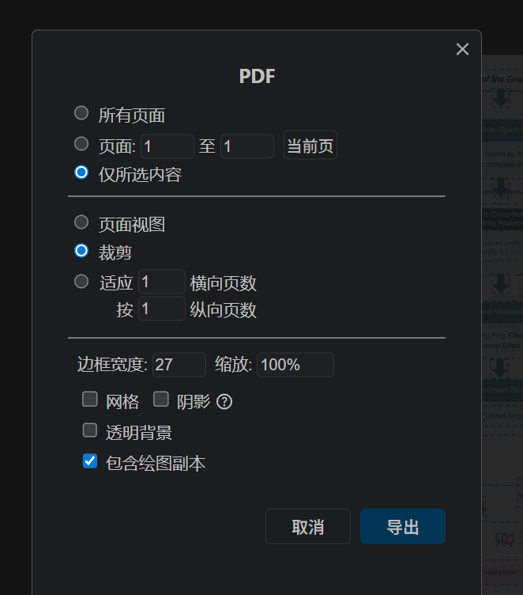

# 一、今天学了什么

## 1. 作图软件&数据查找
- 打开方式：draw.io
- 使用模板：基本流程图

## 2. 遇到的问题
- 连线老是歪

## 3. 操作小结
- visio:基本形状——排列（左对齐水平居中）、位置（横向分布纵向分布）——连接线——双击打字——选中线调形状（形状样式）——出现跨线（设计——取消跨线）
- 亿图：新建空白——符号库——流程图——基本流程形状— 注意事项：取色：先取色再使用、生成顺序靠后约不收位置限制来编辑、括号：
- 思路图同上
## 可以现在网页编辑，上传到在线通过比较的方式更新
- 
## 4. 流程图图标查找：
无填充表示总思路，填充可表具体操作
- Process(设置、箭头图标) 
- Automation 
- setup :电池、设置
| 大类 | 搜索关键词 | 常见图标形象 | 典型用途 / 含义 |
|------|------------|--------------|----------------|
| 准备 / 初始化 | Automation（推荐） | 循环箭头、环形箭头、自动运行符号 | 表示自动流程、自动执行、系统自动运转、批处理 |
|  step1      | Setup | 齿轮、扳手、工具、电池 | 表示初始化设置、参数配置、准备阶段 |
|              | Process | 箭头 + 方块 / 箭头 + 文件 | 表示处理步骤、流程中的一个处理环节 |
|              | Workflow | 分支流程图、节点分叉结构 | 表示完整工作流、多步骤流程 |
|立方体 / 模块 / 结构块|box(推荐)\cube|条件判断、P检验、模型系统 / 方法体系 / 框架模型应用--step2|
| 文档 / 任务 | Document（推荐） / File / Report | 一张或多张纸、文档页 | 表示任务、报告、数据文件、阶段性成果 step3 |
| 终端 / 系统 | Terminal / Window / Console（推荐） | 黑色窗口、命令行界面、窗口框 | 表示程序运行、系统环境、代码执行、平台 step4 |
| 网络 / 结构 | Network（推荐） / Nodes / Cluster(推荐) / Graph | 多个点用线连接、网络结构图 | 表示网络结构、关系图、系统架构、融合结构 step5|
|最终输出 / 决策 / 结论 / 应用 / 反馈|result\output\recommendation\feedback|迭代优化后的最终结果 / 决策输出 / 建议方案

- 
- 示意图：亿图（工程等图）&Axgraph（几何数学类）
- 热力图Easyshu、子弹图、着色图、地图等等SVG
- Python:直接在库复制 Matplotlib、seaborn
- Echarts:直接改代码
- Hiplot:绘图工具——Excel——映射—
- Bioladder:云工具——数据可视化
- Spasspro:分清数据类型
- 
- 绘图顺序：先出整体框架再进行填充
- 填充：填充注意背景色日光夜光模式统一，不要出现拼色，设置Soild,多使用调色板 推荐主色调：#2B76B7、#3C8DA8、#702BA0
- 图标：尽量选择可以调色的，参考我的库
- 大小：尽量选择长而扁，圆角或拼色，可以加背景板
- 字体：Arial,文字颜色注意底色黑白光，尽量不在VS调
- 箭头：注意箭头大小调整
- 图层叠放：
- 直线：尽量连接水平框，否则调出网格线 +关注连接点箭头
- 射线&线段：注意左右水平位置刻度
- 水平垂直等距分布&向上or向下对齐&设置组合&框选
- 注意每个部分之间的联系
- 长按+拖拽：更换图形
- Ctrl+G:转成容器
- Tree Moving:移动下方所有框
- Tree Folding:动态图形展示
- Ctrl Shift :原样复制
- 浮动连线：按照蓝色滑鼠
- 图层面板：分层展示Shift 选中-剪切-粘贴新图层
- deepseek:mermaid形式输出+高级 mermaid格式
- 空白问题：
- SVG自定义与导入：文件-导入 网站：https://iconoir.com/ 、https://lucide.dev/icons/ 、 https://remixicon.com/  箭头等指示标）、https://www.flaticon.com/
- 提示词：1.AI生成：我想画一个关于 [你的主题] 的图，但我不知道如何写最精准的提示词。请帮我写一个能生成高质量 Mermaid 代码的提示词。
- 2.多模态逆向：上传图片-请分析这张图片的结构和逻辑，并将其转换为 Draw.io 可以识别的 Mermaid 代码。保持原图的节点和连接关系。
- 
## 5.数据查找：
- 知网大数据平台（国内）：https://elib.cugb.edu.cn/https/77726476706e69737468656265737421f4f6559d6933665b774687a98c/
- git:https://github.com/awesomedata/awesome-public-datasets
- 国家统计局（可以查询世界组织）：https://data.stats.gov.cn/index.htm?msg=&isLogin=1&tocken=-6804892717282310220&userName=zyc6586%40qq.com
- 大数据导航（各国统计局）最推荐：https://hao.199it.com/#google_vignette
- EPS（没权限）：https://www.epsnet.com.cn/index.html#/Index
- 联合国：https://data.un.org/
- 
- ICPSR: [https://www.icpsr.umich.edu/web/pages/ICPSR/index](https://www.icpsr.umich.edu/web/pages/ICPSR/index)
- 数据世界: [https://ourworldindata.org/](https://ourworldindata.org/)
- Kaggle 数据集: [https://www.kaggle.com/datasets](https://www.kaggle.com/datasets)
- 天池数据集: [https://tianchi.aliyun.com/dataset/](https://tianchi.aliyun.com/dataset/)
- 
## 6.数据补充：
- 插值法、chatgpt
- 
- 数据清洗：获取时出现缺失和异常值、噪声、插入（ 、回归（过一些点）、拉格朗日牛顿插值用多元函数（拉格朗日要过所有点）latex拉格朗日插值、样条插值（相邻两点之间有函数关系）、  、或Matlab(一维二维？)  异常值： 判断出来然后剔除补全：正态分布、箱型图（）不在极限内认为异常、
- 数据集成（文本型数值型）：
- 数据变换：（极大值：成绩、评价；极小值：挂科率；
- 数据规约（代表性）：
- 
## 7.参考文献递交格式
- 参考文献引用：https://www.scribbr.com/ 讲解视频：https://www.bilibili.com/video/BV1mK421y75z/?spm_id_from=333.1391.0.0&vd_source=04e755bb0c5a6e660e7d3dd4084b52fb 
- 较新的文章复制DOI即可
- 大小写：APA只句首大写，第一个单词首字母大写，其余小写(专有名词除外)；不加引号、不加斜体
- 页码符号:用en dash(-)，不是 hyphen(-)
- 期刊/会议名称的斜体 & 大小写
APA 7th 要求:
·期刊名:斜体，每个主要单词首字母大写 不是全部大写
·*卷号:斜体*
·会议论文集名:斜体，主要单词首字母大写 
- 对一个关键词引用2篇契合度高的文献，尽量在8年以内
- 
## 8.模型学习
  spsspro:https://space.bilibili.com/396141319?spm_id_from=333.1387.follow.user_card.click
- 
- 
- 附件：*多模态逆向提示词* 参考23-1C 

graph TD
    %% ==================== 简化样式 ====================
    classDef gru fill:#e3f2fd,stroke:#1976d2
    classDef reg fill:#f3e5f5,stroke:#7b1fa2
    classDef clu fill:#e8f5e8,stroke:#388e3c
    classDef com fill:#fff3e0,stroke:#f57c00
    
    %% ==================== 标题 ====================
    T["1.4 Our Work"]
    
    %% ==================== 左上：GRU模型 ====================
    M1_input["input"]
    M1_reset["reset gate"]
    M1_gru["GRU model"]
    M1_update["update gate"]
    M1_output["output"]
    M1_pred["prediction"]
    M1_date["March 1, 2023"]
    
    M1_input --> M1_reset
    M1_reset --> M1_gru
    M1_gru --> M1_update
    M1_update --> M1_output
    M1_output --> M1_pred
    
    class M1_input,M1_reset,M1_gru,M1_update,M1_output,M1_pred,M1_date gru
    
    %% ==================== 中间：词属性分析 ====================
    M2_title["Relationship of Word Attributes and Scores from Percentage"]
    M2_formula["score = ω₀ + Σp_i + ω₂ × p_x"]
    
    M2_reg["Regression Analysis"]
    M2_wf["Word Frequency"]
    M2_lf["Letter Frequency"]
    M2_fword["f_word"]
    M2_fletter["f_letter"]
    
    M2_box["Box Plot Analysis"]
    M2_rep["Repetition of Letter"]
    M2_rep_val["rep"]
    M2_pos_val["pos"]
    
    M2_attrs["Word Attributes"]
    M2_note1["not linearly related"]
    M2_note2["hard mode"]
    M2_note3["no obvious diff"]
    M2_note4["The most 'hellish' level: PARER"]
    M2_note5["hard to guess"]
    
    M2_title --> M2_formula
    M2_formula --> M2_reg
    M2_formula --> M2_box
    
    M2_reg --> M2_wf --> M2_fword
    M2_reg --> M2_lf --> M2_fletter
    
    M2_box --> M2_rep --> M2_rep_val
    M2_box --> M2_rep --> M2_pos_val
    
    M2_fword --> M2_attrs
    M2_fletter --> M2_attrs
    M2_rep_val --> M2_attrs
    M2_pos_val --> M2_attrs
    
    M2_attrs --> M2_note1
    M2_attrs --> M2_note2
    M2_attrs --> M2_note3
    M2_attrs --> M2_note4
    M2_attrs --> M2_note5
    
    class M2_title,M2_formula,M2_reg,M2_wf,M2_lf,M2_fword,M2_fletter,M2_box,M2_rep,M2_rep_val,M2_pos_val,M2_attrs,M2_note1,M2_note2,M2_note3,M2_note4,M2_note5 reg
    
    %% ==================== 左下：难度率分类 ====================
    M3_formula["δ = σω₀ + Σp_i + σω₂ × p_x"]
    M3_label["Difficulty Rate: δ"]
    M3_eerie["EERIE"]
    M3_kmeans["K-Means++"]
    M3_cluster["Clustering Analysis"]
    M3_class["Difficulty classification"]
    
    M3_formula --> M3_label
    M3_formula --> M3_eerie
    M3_kmeans --> M3_cluster --> M3_class
    
    class M3_formula,M3_label,M3_eerie,M3_kmeans,M3_cluster,M3_class clu
    
    %% ==================== 右侧：GRU+随机森林 ====================
    M4_title["GRU Prediction Model"]
    M4_input["input"]
    M4_grid["Grid Search"]
    M4_grammars["best grammars"]
    M4_rf["Random Forest"]
    M4_pred["Prediction"]
    M4_date1["March 1, 2023"]
    M4_date2["March 1, 2023"]
    
    M4_title --> M4_input
    M4_input --> M4_grid
    M4_grid --> M4_grammars
    M4_grammars --> M4_rf
    M4_rf --> M4_pred
    
    class M4_title,M4_input,M4_grid,M4_grammars,M4_rf,M4_pred,M4_date1,M4_date2 com
    
    %% ==================== 底部标注 ====================
    CAPTION["Figure 2: Our work"]
    
    %% ==================== 连接标题到各模块 ====================
    T --> M1_input
    T --> M2_title
    T --> M3_formula
    T --> M4_title
    
    %% ==================== 连接各模块到底部标注 ====================
    M1_pred --> CAPTION
    M2_note5 --> CAPTION
    M3_class --> CAPTION
    M4_pred --> CAPTION